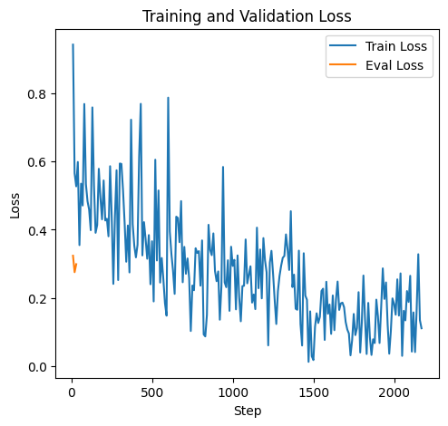
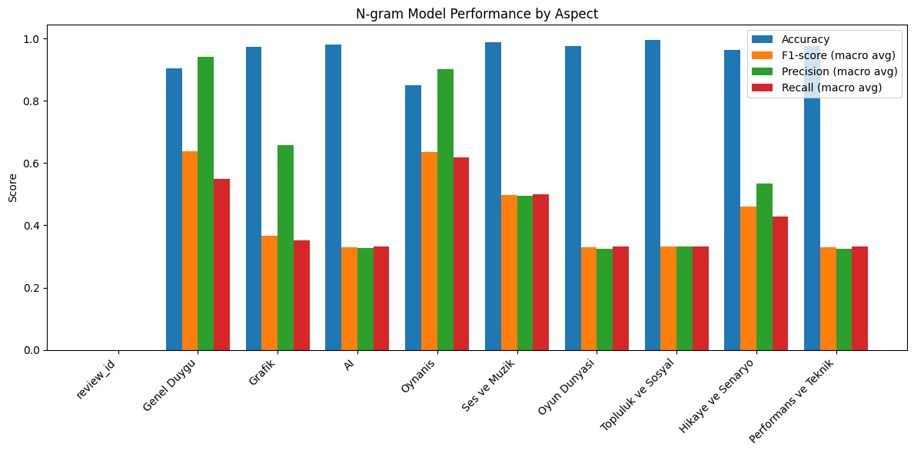

# Turkish Game Review Sentiment Analysis: BERT vs. N-gram Baseline

## Overview
This project implements and compares two approaches for sentiment analysis of Turkish game reviews:

1. **BERT-based Sentiment Model** (using HuggingFace Transformers)
2. **N-gram TF-IDF + Logistic Regression Baseline**

Both models are evaluated for general sentiment and aspect-based sentiment (e.g., AI, Gameplay, Performance, etc.) using a cleaned Turkish review dataset.

---

## Dataset
- **File:** `dataset/cleaned_reviews_zemberek.xlsx`
- **Content:** Turkish game reviews with columns for review text, general sentiment (`Genel Duygu`), and multiple aspect-based sentiment labels (e.g., AI, OYNANIS, PERFORMANS VE TEKNIK, etc.).
- **Label Mapping:** Sentiment labels are mapped to integers using `constants/labels.json`.

---

## Project Structure
- `experiments.ipynb`: Main notebook for data prep, training, evaluation, and visualization.
- `process/`: Contains scripts for training (`train.py`), evaluation (`evaluate.py`), and preprocessing.
- `models/instances.py`: Model definitions and factory functions for BERT and n-gram models.
- `output/`: Stores model checkpoints, logs, and results.
- `utils/`: Data and JSON loading utilities.

---

## Models

### 1. BERT-based Sentiment Model
- **Model:** `dbmdz/bert-base-turkish-cased` (HuggingFace Transformers)
- **Task:** Multi-class classification (Olumlu, Olumsuz, Nötr)
- **Training:**
  - Fine-tuned on review text for general sentiment (`Genel Duygu`).
  - Can be extended for aspect-based sentiment by training separate models per aspect.
- **Output:** Model checkpoints in `output/sentiment_model/`.

### 2. N-gram TF-IDF + Logistic Regression Baseline
- **Model:** MultiOutputClassifier(LogisticRegression) with TF-IDF features
- **Task:** Multi-label, multi-class classification (predicts all aspects at once)
- **Training:**
  - Uses review text as input, all aspect columns as targets.
  - Vectorization: TF-IDF (unigrams, max_features=2000 for efficiency)
- **Output:** Model and vectorizer in `output/ngram_model/`.

---

## Training & Evaluation Workflow

### Data Preparation
- Load and map labels using `constants/labels.json`.
- Split data into train/validation sets.

### Training
- **BERT:**
  - Run `train_bert_model(train_df, val_df, num_labels=3)`
  - Trains and saves checkpoints.
- **N-gram:**
  - Run `train_ngram_model(train_df, val_df, output_dir, aspect_cols, ngram_range=(1,1), max_features=2000)`
  - Trains a single model for all aspects.

### Evaluation
- **BERT:**
  - Evaluate on validation set using accuracy, F1, confusion matrix.
- **N-gram:**
  - Evaluate all aspects at once using `evaluate_ngram_model`.
  - Metrics: accuracy, macro F1, precision, recall per aspect.

### Visualization
- Training/validation loss and accuracy curves (BERT)
- Bar plots of accuracy, F1, precision, recall by aspect (n-gram)
- Example predictions for both models

---

## Example Results

### Training Curves (BERT)


### N-gram Model Aspect Performance


---

## Example Predictions

**BERT Model:**
```
Review: Oyun harika, çok beğendim...
Predicted Sentiment: Olumlu
```

**N-gram Model:**
```
Review: Oyun harika, çok beğendim...
Genel Duygu: Olumlu
AI: Nötr
OYNANIS: Olumlu
PERFORMANS VE TEKNIK: Olumsuz
...
```

---

## How to Run
1. Install requirements:  
   `pip install -r requirements.txt`
2. Run `experiments.ipynb` for end-to-end workflow.
3. Models and results are saved in the `output/` directory.

---

## Notes
- The n-gram model is a strong, interpretable baseline and can be used for quick experiments or as a sanity check for deep models.
- BERT provides state-of-the-art performance but requires more resources.
- Both models are modular and easy to extend for new aspects or datasets.

---

## Authors
- DEMBA SOW
- May 2025
